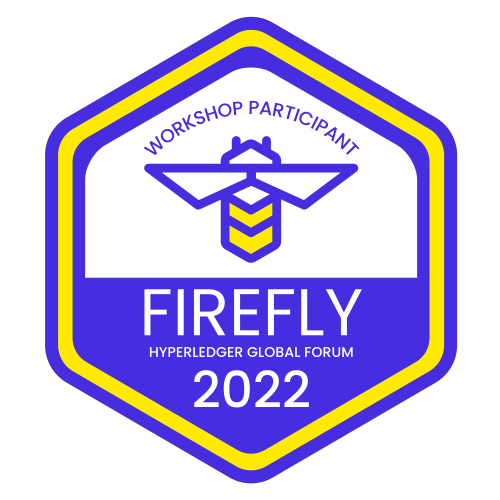

# Hyperledger FireFly Workshop
_Hyperledger Global Forum 2022_

Welcome to the FireFly Workshop at Hyperledger Global Forum 2022! We're glad you're here! By the end of this workshop you will have learned through hands on experience how to:

- Set up a FireFly local development environment
- Connect FireFly to a public testnet
- Interact with existing token contracts on chain
- Mint an exclusive NFT that is **yours to keep!**
- Launch your own NFT using Hyperledger FireFly

The workshop is divided into two sections. [Part I](./docs/part_i.md) will focus on setting everything up and minting your first NFT using a contract that already exists on chain. [Part II](./docs/part_ii.md) will walk you through launching your own token contract on a public testnet using FireFly.

<figure>

<figcaption align = "center"><b>Claim a copy of this exclusive FireFly Workshop Participant badge on a public chain!</b></figcaption>
</figure>

## High level overview of components of the workshop

## Prerequisites

In order to run this workshop on your machine, you will need a few things installed on your dev machine:

- [Docker](https://www.docker.com/)
- [Docker Compose](https://docs.docker.com/compose/)
- openssl

### Linux Users
> **NOTE**: For Linux users, it is recommended that you add your user to the `docker` group so that you do not have to run the FireFly CLI or `docker` as `root` or with `sudo`. For more information about Docker permissions on Linux, please see [Docker's documentation on the topic](https://docs.docker.com/engine/install/linux-postinstall/).

### Windows Users
 > **NOTE**: For Windows users, we recommend that you use [Windows Subsystem for Linux 2 (WSL2)](https://docs.microsoft.com/en-us/windows/wsl/). Binaries provided for Linux will work in this environment.

## [Part I](./docs/part_i.md)
Setting everything up and minting your first NFT using Hyperledger FireFly

## [Part II](./docs/part_ii.md)
Launching your own custom ERC-721 token using Hyperledger FireFly