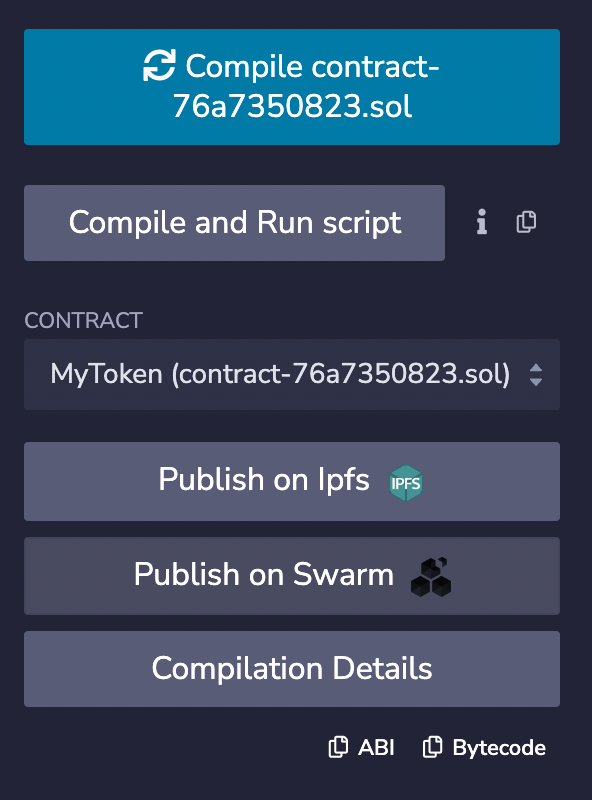

# Hyperledger FireFly Workshop: Part II
_Hyperledger Global Forum 2022_

In Part II of this workshop you will create and deploy your own NFT contract on the Polygon Mumbai testnet. You can either use the resources provided in this git repo, or use your own smart contract and image.

## Use FireFly to upload your image

Your local FireFly Supernode also has an IPFS node running locally. You can use FireFly's data APIs to upload your NFT image and metadata.

In the `resources` directory of this git repo, there is a file called `firefly-badge.svg`. You're welcome to use this file, or create your own artwork to upload. You can use the [FireFly Swagger UI](http://localhost:5000/api#/Default%20Namespace/postData) to upload you image.

> **NOTE**: To upload a file through the Swagger UI, make sure you select `multipart/form-data` from the drop down menu on that endpoint.
>
> 
>
> You will also need to uncheck the bottom two checkboxes for the `metadata` and `validator` fields.
>
> 

When you click **Execute** to upload the file, FireFly should return a payload like this:

```json
{
    "id": "1acda94e-968b-4d7a-bce9-f0722f86ba40",
    "validator": "json",
    "namespace": "default",
    "hash": "aab15eed39d67b5b1ec928d578ff38a631e6cddc5015d2e8a06d4d72fdf01649",
    "created": "2022-09-07T15:39:47.148889596Z",
    "value": null,
    "blob": {
        "hash": "aab15eed39d67b5b1ec928d578ff38a631e6cddc5015d2e8a06d4d72fdf01649",
        "size": 43866,
        "name": ""
    }
}
```

At this point, FireFly has only stored the file in its *private* data store. To tell FireFly that we would like to make this file available *publicly*, copy the UUID from the `"id"` field in the response above, and call the publish endpoint. You can use the [FireFly Swagger UI](http://127.0.0.1:5000/api#/Default%20Namespace/postDataBlobPublish) to publish the uploaded file to IPFS. 

> **NOTE:** Be sure to set the `dataid` field in the path with the ID returned in the previous response. Also clear out all of the `additionalProp` fields in the request body. Your request body should be an empty JSON object: `{}`


FireFly will return a response like this;

```json
{
  "id": "1acda94e-968b-4d7a-bce9-f0722f86ba40",
  "validator": "json",
  "namespace": "default",
  "hash": "aab15eed39d67b5b1ec928d578ff38a631e6cddc5015d2e8a06d4d72fdf01649",
  "created": "2022-09-07T15:39:47.148889596Z",
  "value": null,
  "blob": {
    "hash": "aab15eed39d67b5b1ec928d578ff38a631e6cddc5015d2e8a06d4d72fdf01649",
    "size": 43866,
    "name": "",
    "public": "QmYM6ph25YpDZa2u4joPRhGEjnkHGp9JqZjQDpvdgPZ9Vj"
  }
}
```

Here I can see in the `"public"` field that FireFly has uploaded my image to my local IPFS node its CID is:

```
QmYM6ph25YpDZa2u4joPRhGEjnkHGp9JqZjQDpvdgPZ9Vj
```

Take note of this CID, because we will need to put it in your `metadata.json` file in the next step.

> **NOTE**: It may take some time for your file to be readily accessible from public IPFS gateways. I've seen it take up to 15 minutes to replicate sometimes.

## Create your `metadata.json` file

[EIP-721](https://eips.ethereum.org/EIPS/eip-721) defines an interface for retrieving a URI for a given NFT token index. A common practice is to store the `metadata.json` file on IPFS so it is immutable. The `metadata.json` file for this token looks like this:

```json
{
  "description": "Exclusive promotional badge for participating in the FireFly Workshop at Hyperledger Global Forum 2022", 
  "external_url": "https://hyperledger.github.io/firefly", 
  "image": "https://ipfs.io/ipfs/QmYM6ph25YpDZa2u4joPRhGEjnkHGp9JqZjQDpvdgPZ9Vj", 
  "name": "Hyperledger FireFly Workshop Participant - Global Forum 2022"
}
```

You should create your own `metadata.json` document and be sure that the image URL points to the IPFS CID for your file that you uploaded in the previous step.

## Upload your `metadata.json` file to IPFS

To upload your `metadata.json`, repeat the steps from the section above where you used FireFly's API to upload your image. Make note of the IPFS CID for your `metadata.json` file. In my case, mine was:

```
QmXrjciH9hPzKEUpvZLG84gMhMrXN1DLWc6CpbwBg8P6j4
```

## Create your own ERC-721 token contract

Now that you have your image, and your metadata on IPFS, we can set up the smart contract itself. You can either use the [contract in this repo](../contracts/FireFlyWorkshopBadge.sol) as a starting point, or you can create your own. The [Open Zeppelin Contracts Wizard](https://docs.openzeppelin.com/contracts/4.x/wizard) is a great starting point if you want to create your own contract.

**Make sure you update your contract to point to the IPFS CID of your `metadata.json` file you uploaded in the previous step.**

### Compile your contract

If you're using this git repo, you can run:

```
npm install
npx hardhat compile
```

This will create a directory structure under `artifacts` which will contain a `.json` file containing the ABI and the EVM bytecode for your contract.

If you started with the The [Open Zeppelin Contracts Wizard](https://docs.openzeppelin.com/contracts/4.x/wizard), you can click **Open in Remix**. This will open the Remix web based IDE which can compile your contract for you.



You can then click the **ABI** button to copy your contract's ABI to your clipboard.

## Deploy your contract

You will need the `.json` file that your compiler generated in the previous step. If you used hardhat to compile a contract in this project, it will be at `artifacts/contracts/<contract_name>.sol/<contract_name>.json`

If you compiled your contract with Remix, the `.json` file will be under the `artifacts` directory. Copy the contents of this file to a file on your local file system.

You can use the FireFly CLI to deploy your contract with a command like this:

```
ff deploy ethereum workshop <your_contract>.json
```

```
{
  "address": "0x9ddf36dde4ef2d2f2da54ef82441e640832870eb"
}
```

It's a good idea to search for your contract address on [Polygonscan](https://mumbai.polygonscan.com/) to find out what block number in which the contract was constructed. You will need this for the next step.

## Create a new token pool

At this point we will create a new Token Pool for your contract. You can do this just like we did in the first part of the workshop through the [FireFly Sandbox](http://127.0.0.1:5109/home?action=tokens.pools).

## Create a Contract Interface and API

Now we will create a Contract Interface and API just like we did in the first part of the workshop with the [FireFly Sandbox](http://127.0.0.1:5109/home?action=contracts.interface).

You will need to get the ABI from the JSON file that your compiler used when ou compiled your contract. Depending on whether you used Hardhat or Remix this may vary.

## Mint a token to your wallet

Lastly, you can open the Swagger UI for your custom contract, and mint some tokens!

## Congratulations!

Congratulations! You've launched your very own NFT contract using FireFly on a public blockchain! Now you are equipped with the tools you need to launch your own Web3 project on public chains.